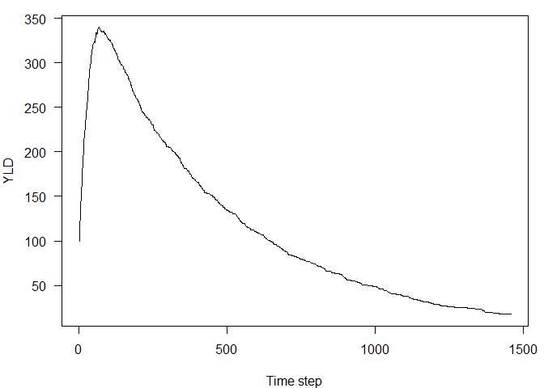
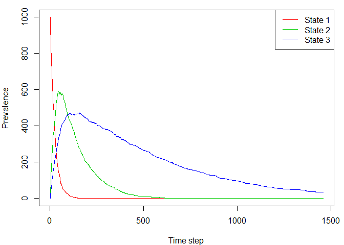
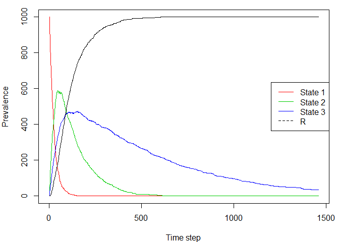
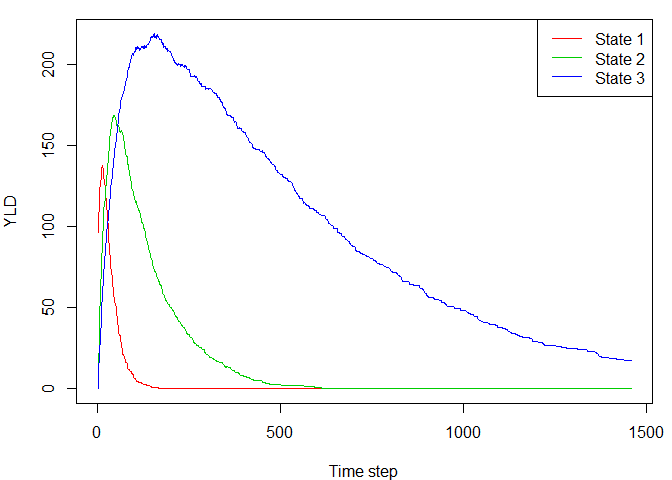
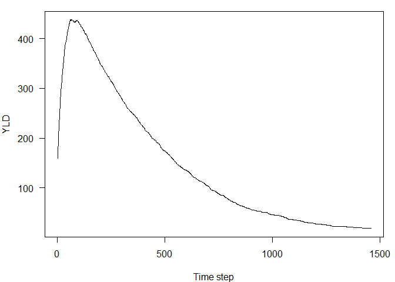
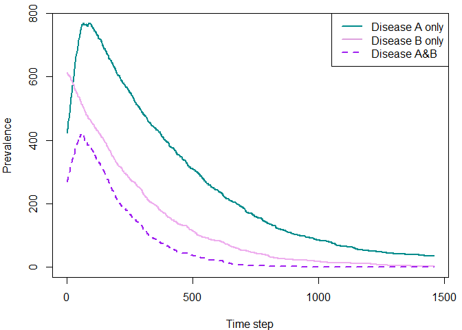
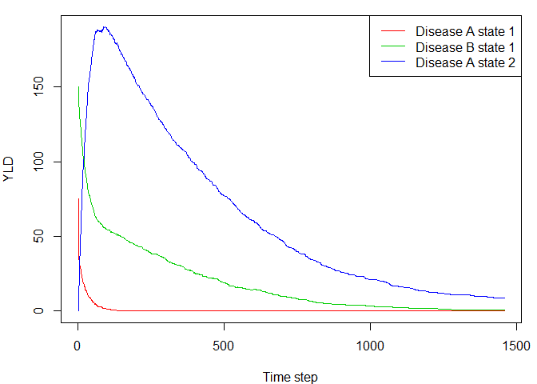
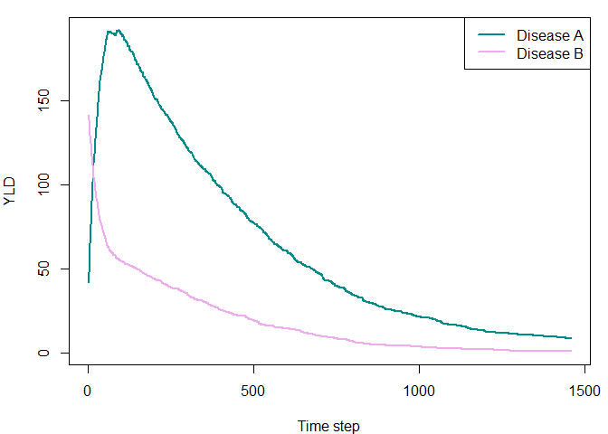

DALY-IBM.R
================
Bdevleesschauwer
Wed Feb 27 11:09:37 2019

``` r
### DALY individual based model
### .. one day time steps
### .. situation (i) state 1 -> 2|3 or 1 -> 2&3; 2 -> R; 3 -> R
### .. situation (ii) 
##
### Created: 12/04/2017
### Last update: 17-7-2017 SM | 26-2-2019 BD
### 
###  - added -> Recovery transitions
###  - added 'not-recovered' to definition of 'susc' 
###  - added ageing

## functions

# Multiplicative assumption for combining dws
dw_multi <-
function(...) {
  dw <- unlist(list(...))
  1 - prod(1 - dw)
}

get_yld <-
function(x) {
  sum(x$dw)
}


#############################################################################
### Situation (i)
### .. 3 health states
### .. same pt can experience health state 2 & 3 simultaneously
### .. all individuals *start* in health state 1

## settings
n <- 1000       # number of individuals  [=1000]
s <- 365*4      # number of time steps, 4[WAS 10] years
mean_age <- 20  # mean age of population (yrs) 

dw1 <- 0.100
dw2 <- 0.300
dw3 <- 0.500

tp_12 <- 3/100   # transition probability 1 -> 2
tp_13 <- 1/100   # transition probability 1 -> 3
rp_2  <- 1/100   # recovery probability 2 -> R
rp_3  <- 1/500   # recovery probability 3 -> R

## initialize; 1 row for each individual
dfr <-
data.frame(age = rpois(n, mean_age),
           hs1 = TRUE,
           hs2 = FALSE,
           hs3 = FALSE,
           r = FALSE,     # SM added 'Recovered' indicator
           dw = dw1)
yld <- numeric(s)
yld[1] <- get_yld(dfr)
# SM added plotting variable
yld_strat <- matrix(c(dw1*n, 0, 0), nrow = s, ncol = 3, byrow = T)
prev <- matrix(0, nrow = s, ncol = 4)  # 4th col is for 'Recovered' state
prev[1, ] <- c(n, 0, 0, 0)


## run
for (i in seq(2, s)) {

  ## age population 1 time step; check if RLE exceeded [TO DO]
  dfr$age <- dfr$age + 1
  
  ## indicator vectors; randomly determine progressions and recoveries
  get_hs2 <- rbinom(n, 1, tp_12) == 1
  get_hs3 <- rbinom(n, 1, tp_13) == 1
  recover_hs2 <- rbinom(n, 1, rp_2) == 1
  recover_hs3 <- rbinom(n, 1, rp_3) == 1

  ## individuals may recover/undergo remission from health states 2 and 3
  has_2 <- dfr$hs2
  has_3 <- dfr$hs3
  dfr$hs2[has_2][recover_hs2[has_2]] <- FALSE
  dfr$hs3[has_3][recover_hs3[has_3]] <- FALSE
  dfr$r[has_2][recover_hs2[has_2]] <- TRUE    # SM added these 2 lines
  dfr$r[has_3][recover_hs3[has_3]] <- TRUE

  ## individuals may develop health states 2 and/or 3
  ## if 'susceptible' (not already in state & not already recovered)
  not_recov <- !dfr$r  # SM added definition of [not yet] recov[ered]
  susc_2 <- !dfr$hs2 & not_recov
  susc_3 <- !dfr$hs3 & not_recov
  dfr$hs2[susc_2][get_hs2[susc_2]] <- TRUE
  dfr$hs3[susc_3][get_hs3[susc_3]] <- TRUE
  dfr$hs1[get_hs2[susc_2]] <- FALSE
  dfr$hs1[get_hs3[susc_3]] <- FALSE

  ## calculate combined DW
  ## NB. 2:4 refers to column indices of in-health state indicators
  dfr$dw <- apply(dfr[, 2:4], 1, function(x) dw_multi(c(dw1, dw2, dw3)[x]))

  ## calculate population-level total YLD over time
  ## also stratified by state (1, 2, 3)
  yld[i] <- get_yld(dfr)
  denom <- (dw2*dfr$hs2 + dw3*dfr$hs3)
  
  # dw always equals dw1
  # as indiv *cannot* be in state 1 & also another state
  yld_strat[i, 1] <- sum(dfr$dw[dfr$hs1])

  yld_strat[i, 2] <- sum(dfr$dw[dfr$hs2] * (dw2/denom[dfr$hs2]))
  yld_strat[i, 3] <- sum(dfr$dw[dfr$hs3] * (dw3/denom[dfr$hs3]))

  ## record state-occupation over time
  ## to calc prevalence[=no. individuals] per state over time
  prev[i, ] <- c(nrow(dfr[dfr$hs1 == TRUE, ]),
                 nrow(dfr[dfr$hs2 == TRUE, ]),
                 nrow(dfr[dfr$hs3 == TRUE, ]),
                 nrow(dfr[dfr$r == TRUE, ]))
}

# Plot total YLD in population over time
par(mar = c(4, 4, 1, 1))
plot(seq(s), yld, type = "l", las = 1, xlab = "Time step", ylab = "YLD")
```

<!-- -->

``` r
# Plot prevalence over time, separate series for each of 3 states
matplot(seq(s), prev[, 1:3],
        col = c(2, 3, 4), lty = 1, type = "l",
        xlab = "Time step", ylab = "Prevalence")
legend("topright", legend = c("State 1", "State 2", "State 3"),
       col = c(2:4), lty = 1, lwd = 1.5)
```

<!-- -->

``` r
# Or including state 'R'
matplot(seq(s), prev, 
        col = c(2, 3, 4, 1), lty = 1, type = "l",
        xlab = "Time step", ylab = "Prevalence")
legend("right", legend = c("State 1", "State 2", "State 3", "R"),
       col = c(2:4, 1), lty= c(1, 1, 1, 2), lwd = 1.5)
```

<!-- -->

``` r
# Plot YLD over time, stratified by state
# use 'redistribution method' to reverse-allocate YLD to states 2 & 3 
matplot(seq(s), yld_strat,
        col = c(2, 3, 4), lty = 1, type = "l",
         xlab = "Time step", ylab = "YLD")
legend("topright", legend = c("State 1", "State 2", "State 3"),
       col = 2:5, lty = c(1, 1, 1), lwd = 1.5)
```

<!-- -->

``` r
#############################################################################
### Situation (ii)
### .. 2 diseases, 3 health states in total
### .. pt can occupy 5 different states/state combinations
### .. all ind *start* in health state 1 of either disease A or B (or both)

## settings
n <- 1000       # number of individuals  [=1000]
n_A <- 0.4*n    # assumed independent disease prevalence ratio (A:B) = 4:6
n_B <- 0.6*n

s <- 365*4      # number of time steps, 4[WAS 10] years
mean_age <- 20  # mean age of population (yrs) 

dwA1 <- 0.100
dwA2 <- 0.500
dwB1 <- 0.200

tp_A1A2 <- 3/100  # transition probability A1 -> A2
rp_A2 <- 1/400    # recovery probability A2 -> R
rp_B1 <- 1/300    # recovery probability B1 -> R

## initialize; 1 row for each individual
dfr <-
data.frame(age = rpois(n, mean_age),
           dAhs1 = FALSE,
           dBhs1 = FALSE,
           dAhs2 = FALSE,
           r = FALSE,     # 'Recovered' indicator
           dw = NA)

# assign initial nr individuals in starting state (A1, B1) of each disease:
# assume that multi-morbidity (having both disease A and B) is random
dfr$dAhs1 <- rbinom(n, 1, n_A/n) == 1
dfr$dBhs1 <- rbinom(n, 1, n_B/n) == 1

# assign initial dw using multiplicative method
dfr$dw <- apply(dfr[, 2:3], 1, function(x) dw_multi(c(dwA1, dwB1)[x]))

initA <- nrow(dfr[dfr$dAhs1==TRUE, ])
initB <- nrow(dfr[dfr$dBhs1==TRUE, ])

# eg. n=236 starting in dAhs1 & dBhs1 
#nrow(dfr[dfr$dAhs1 == TRUE & dfr$dBhs1 == TRUE, ])

yld <- numeric(s)
yld[1] <- get_yld(dfr)

# initialise plotting variable
denom <- (dwA1*dfr$dAhs1 + dwB1*dfr$dBhs1)

yld_strat <-
  matrix(c(sum(dfr$dw*(dwA1/denom), na.rm = TRUE),
           sum(dfr$dw*(dwB1/denom), na.rm = TRUE),
           0),
         nrow = s, ncol = 3, byrow = TRUE)

# initialise another plotting variable
yld_dis <- matrix(c(NA, NA), nrow = s, ncol = 2, byrow = TRUE)

##yld_dis <- matrix(c(dwA1,dwB1),nrow=s,ncol=2,byrow=T)

# prevalent number indivs in [dAhs1, dBhs1, dAhs2, R] states 
prev <- matrix(0, nrow = s, ncol = 4)
prev[1, ] <- c(initA, initB, 0, 0)

# prevalent number indivs with disease [A, B, A&B] 
prev_dis <- matrix(0, nrow = s, ncol = 3)
prev_dis[1, ] <-
  c(initA, initB, nrow(dfr[dfr$dAhs1 == TRUE & dfr$dBhs1 == TRUE, ]))

## run
for (i in seq(2, s)) {

  ## age population 1 time step; check if RLE exceeded [TO DO]
  dfr$age <- dfr$age + 1
  
  ## indicator vectors; randomly determine progressions and recoveries
  get_dAhs2 <- rbinom(n, 1, tp_A1A2) == 1
  recover_dAhs2 <- rbinom(n, 1, rp_A2) == 1
  recover_dBhs1 <- rbinom(n, 1, rp_B1) == 1

  ## indv may recover/undergo remission from health states A2 and B1 only
  has_A2 <- dfr$dAhs2
  has_B1 <- dfr$dBhs1
  dfr$dAhs2[has_A2][recover_dAhs2[has_A2]] <- FALSE
  dfr$dBhs1[has_B1][recover_dBhs1[has_B1]] <- FALSE
  dfr$r[has_A2][recover_dAhs2[has_A2]] <- TRUE
  dfr$r[has_B1][recover_dBhs1[has_B1]] <- TRUE

  ## indv may transition A1 -> A2 if 'susceptible'
  ## (not already in state & not already recovered)
  not_recov <- !dfr$r
  susc_A2 <- !dfr$dAhs2 & not_recov
  dfr$dAhs2[susc_A2][get_dAhs2[susc_A2]] <- TRUE
  dfr$dAhs1[get_dAhs2[susc_A2]] <- FALSE

  ## calculate combined DW
  ##NB. 2:4 refers to column indices of in-health state indicators
  dfr$dw <- apply(dfr[, 2:4], 1, function(x) dw_multi(c(dwA1, dwB1, dwA2)[x]))

  ## calculate population-level total YLD over time; and stratified by state
  yld[i] <- get_yld(dfr)
  denom <- (dwA2*dfr$dAhs2 + dwB1*dfr$dBhs1 + dwA2*dfr$dAhs2)

  tmp <- dfr$dw[dfr$dAhs1] * (dwA1/denom[dfr$dAhs1])
  yld_strat[i, 1] <- sum(tmp[is.finite(tmp)])

  tmp <- dfr$dw[dfr$dBhs1] * (dwB1/denom[dfr$dBhs1])
  yld_strat[i, 2] <- sum(tmp[is.finite(tmp)])

  tmp <- dfr$dw[dfr$dAhs2] * (dwA2/denom[dfr$dAhs2])
  yld_strat[i, 3] <- sum(tmp[is.finite(tmp)])

  ## also YLD by disease (A, B)
  # sum already-re-distributed YLD
  yld_dis[i, 1] <- yld_strat[i, 1] + yld_strat[i, 3]
  yld_dis[i, 2] <- yld_strat[i, 2]

  ## record state-occupation over time
  ## calc prevalence per each of 3 states (A1, B1, A2) + Recovered
  prev[i,] <-
    c(nrow(dfr[dfr$dAhs1 == TRUE, ]),
      nrow(dfr[dfr$dBhs1 == TRUE, ]),
      nrow(dfr[dfr$dAhs2 == TRUE, ]),
      nrow(dfr[dfr$r == TRUE, ]))

  ## calc prevalence per disease A, disease B, and A&B over time
  prev_dis[i,] <-
    c(nrow(dfr[dfr$dAhs1 == TRUE | dfr$dAhs2 == TRUE,]),
      nrow(dfr[dfr$dBhs1 == TRUE, ]),
      nrow(dfr[(dfr$dAhs1 == TRUE | dfr$dAhs2 == TRUE) &
             dfr$dBhs1 == TRUE, ]))
}

# Plot total YLD in population over time
par(mar = c(4, 4, 1, 1))
plot(seq(s), yld,
     type = "l", las = 1,
     xlab = "Time step", ylab = "YLD")
```

<!-- -->

``` r
# Plot prevalence over time
# separate series for each of disease A-only, disease B-only, disease A&B
matplot(seq(s), prev_dis[, 1:3],
        col = c("darkcyan", "plum2", "purple"),
        lty = c(1, 1, 2), lwd = 2, type = "l",
        xlab = "Time step", ylab = "Prevalence")
legend("topright",
       legend = c("Disease A only", "Disease B only", "Disease A&B"),
       col = c("darkcyan", "plum", "purple"), lty = c(1, 1, 2), lwd = 2)
```

<!-- -->

``` r
# Plot YLD over time, stratified by state
# use 'redistribution method' to reverse-allocate YLD to atates A1, B1, A2
matplot(seq(s), yld_strat,
        col = c(2, 3, 4), lty = 1, type = "l",
        xlab = "Time step", ylab = "YLD")
legend("topright",
       legend = c("Disease A state 1", "Disease B state 1",
                  "Disease A state 2"),
       col = c(2:4), lty = c(1, 1), lwd = 1.5)
```

<!-- -->

``` r
# Plot YLD over time, stratified by disease
# use 'redistribution method' to reverse-allocate YLD to disease A, disease B
matplot(seq(s), yld_dis,
        col = c("darkcyan", "plum2"),
        lty = 1, type = "l", lwd = 2,
        xlab = "Time step", ylab = "YLD")

legend("topright", legend = c("Disease A", "Disease B"),
       col = c("darkcyan", "plum2"), lty = c(1, 1), lwd = 2)
```

<!-- -->

``` r
##rmarkdown::render("DALY-IBM.R")
```
